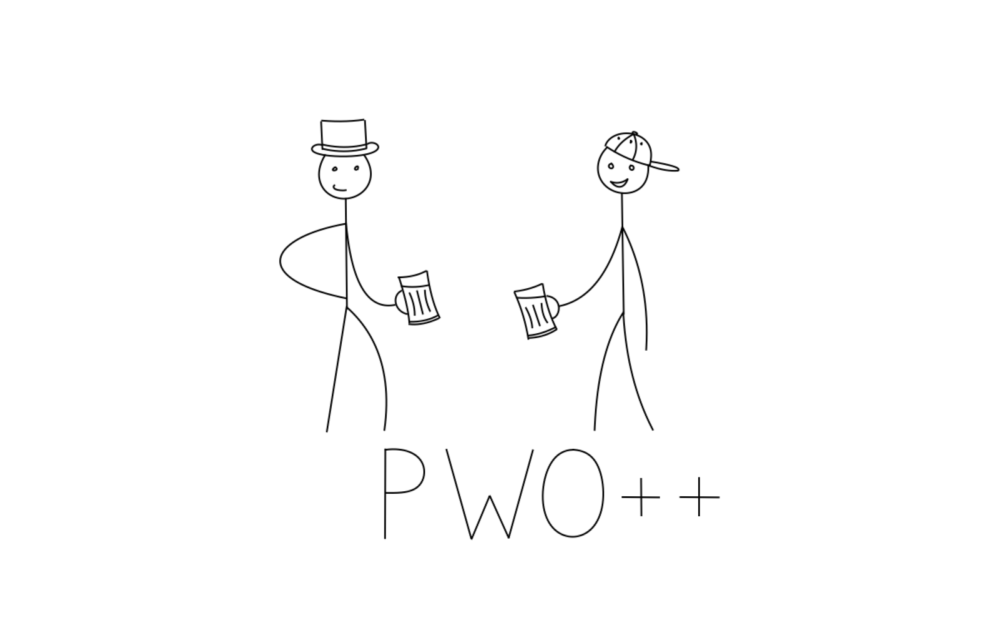

# Bézier Animation Tool

This project is a Bézier curve-based animation editor that I developed as part of a Numerical Analysis university course. The application allows users to interactively draw Bézier curves frame-by-frame and generate animated sequences from them. The final output can be exported as a `.gif` or `.mp4` file. The project was awarded the highest score in the course.

## Features
- Full-screen GUI for intuitive editing of Bézier curves.
- Add, drag, or delete control points with mouse clicks.
- Save and modify curve frames with keyboard shortcuts.
- Export animation as a GIF or MP4.
- Session persistence via JSON file for curves.
- Separation of roles into distinct modules for maintainability.

## Directory Structure
```
├── main.py                       # Entry point for the application
├── drawing.py                    # Bézier curve rendering and De Casteljau logic
├── frame_curve_editor.py        # Main GUI logic for editing Bézier curve frames
├── clear_animation.py           # Script to clear the animation folder except frame0.png
├── requirements.txt             # Python dependencies
├── animation/                   # Temporary frame output storage
│   ├── frame0.png
│   └── ...
└── saved_animations/           # Final outputs and saved projects
    └── beer_clang/             # Example project folder
        ├── animation.gif
        ├── animation.mp4
        ├── frame0.png
        ├── ...
        ├── frame34.png
        └── saved_curves.json
```

## Award-Winning Animation

The included animation in `saved_animations/beer_clang` which I made using this tool only, is the one that **won first place** in the Numerical Analysis course contest. It features a smooth Bézier-crafted beer mug illustration and a changing bottom text - an inside joke among students and faculty :))


Feel free to move its contents to the `animation/` folder to explore it, modify it, or use it as a starting point for your own creations!

## Usage
### Installation
Install the required dependencies with:
```bash
pip install -r requirements.txt
```

### Running the Application
Start the GUI editor with:
```bash
python main.py
```

### Controls
- **Left click (LPM)**: Add or drag a control point
- **Right click (PPM)**: Remove a control point
- **Enter**: Save the current Bézier curve or enter edit mode for a selected one
- **Backspace**: Delete the last or selected Bézier curve
- **Arrow keys**: Navigate frames or select curves
- **Shift**: Automatically generate and draw a predefined mug shape

### Export
After creating frames and clicking "End", the animation is rendered and exported to:
- `animation/animation.gif`
  or
- `animation/animation.mp4`

## Technical Details
- Bézier curves are rendered using the De Casteljau algorithm.
- The animation is built using `matplotlib.animation.ArtistAnimation`.
- All data and images are processed with NumPy and Matplotlib.

---

Enjoy exploring Bézier curves — and feel free to extend or remix the tool!
